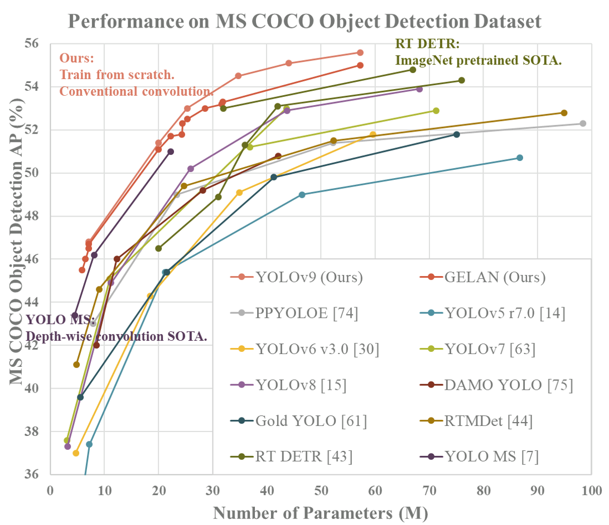

# Identify-and-warn-of-fire-and-explosion

Dataset - https://universe.roboflow.com/catargiuconstantin/firesmokedataset/dataset/2
        - GGdrive https://drive.google.com/drive/folders/1yrOg-DV_fkiu2aWtRi6ftH_v4MGoTtEd

    

## First
pip install -r requirements.txt
## Second 
+change path 
+The file with the sound u need to double /
